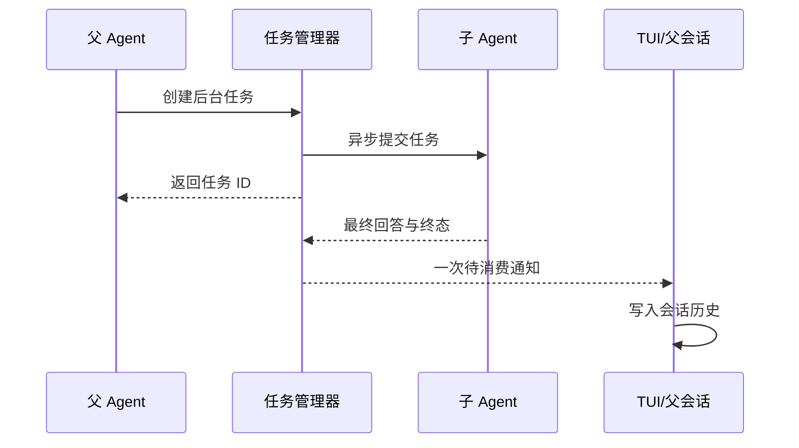

# MewCode 面试案例

## 参考与取材

- 下面的 Example 参考飞书《MewCode 项目面试题》的展开程度：讲透核心约束、具体场景、处理方式和追问，而不是只给结论。`docs/interview-cases.md` 仅是现有案例草稿，不是篇幅或细节上限。
- 核对当前分支的相关源码，只选择能讲清工程判断的经历。普通操作失误只有体现出有价值的诊断或交付经验时才写。参考文章提供表达方式，不能证明 MewCode 已实现其中的功能。

## 写作方式

- 用第一人称「面试官：…… / 我：……」组织问答。按案例需要展开背景与约束、具体问题、定位过程、方案和运行流程、取舍与边界；以条理清晰为准，不限定回答长度，也不硬套固定段数。
- 涉及多轮调用、前后台切换等难以单靠文字说明的流程时，可补一张简洁的 Mermaid 流程图或时序图；图示辅助解释，不替代可直接口述的回答。
- 分清设计目标和已实现行为，不编造事故、功能或未测出的收益。文末只附最关键的源码位置，不附验证链接。
- 用户要求维护现有案例时，更新 `docs/interview-cases.md` 并保留仍有用的内容。

## Example：后台子 Agent 的结果怎么回到父对话

**面试官：** 你让子 Agent 在后台跑，父 Agent 怎么可靠拿到结果？

**我：** 我先把返回路径分开处理。定义式子 Agent 可以在前台等待完成，直接把结果交给父 Agent；Fork 或显式后台任务则先返回任务 ID，让父 Agent 继续工作。前台任务运行较久时也可以转后台，转的是同一个任务，不会重新启动子 Agent。

这里最容易出错的是“什么算最终结果”。子 Agent 可能先输出一段解释，接着调用工具，然后才给出结论。如果把流式文本一直拼下去，工具调用前的中间话也会混进结果。我让任务管理器按事件收口：一轮文本后只要出现工具调用，就清掉这段暂存文本；最后只保留没有继续调用工具的那轮回答。失败和取消也进入明确的终态。

后台任务结束时，我先把完成通知放进所属会话的队列，再让等待方观察到任务终态；同一个任务只投递一次。终端界面取出通知并写入父会话历史，父 Agent 下一次请求就能看到结果。这样父侧不会先观察到“任务已完成”，却还拿不到通知。当前实现是在同一进程里管理任务，子 Agent 共享项目文件系统，没有独立 Worktree 或 Agent 邮箱。

**面试官追问：** 前台运行到一半转后台，会不会把任务执行两次？

**我：** 不会。转后台只把现有任务标记为已发布，并把它的任务 ID 交给父 Agent；子 Agent 继续原来的运行。完成后仍走同一条通知路径，父 Agent 取消时也能定位并取消这个任务。

关键代码：`src/main/java/com/mewcode/subagent/SubAgentRuntime.java`、`src/main/java/com/mewcode/subagent/SubAgentTaskManager.java`、`src/main/java/com/mewcode/tui/MewCodeModel.java`。
