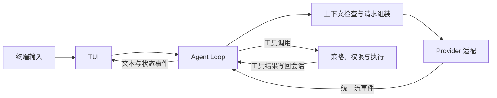

# Example：如何介绍 MewCode 的整体设计

这个示例展示如何把项目主线、关键决策、具体工程约束和取舍讲清楚。写其他案例时，应按问题选择重点，不必照搬问题数量或段落结构。

**面试官：** 你做的 MewCode 整体是怎么设计的？

**我：** MewCode 是一个 Java 写的终端 AI 编程助手。我的设计主线是把“模型建议做什么”和“程序实际允许做什么”分开：模型负责推理和提出工具调用，Agent Loop 负责多轮编排，本地执行层负责工具校验、权限判断和执行，TUI 负责交互与状态展示。

一次请求从终端输入开始。Agent Loop 根据当前模式、会话历史和可见工具组装请求；上下文管理器在请求前检查预算，必要时压缩旧内容。Provider 适配层把不同模型服务的流式响应转成统一事件。模型如果只输出文本，这轮就结束；如果提出工具调用，执行层先按本轮策略和权限检查，再执行工具，把调用和结果一起写回会话，随后进入下一轮。这样模型接口、对话编排、执行边界各有明确职责。

**面试官：** 这套设计里，你认为最重要的几个决策是什么？

**我：** 第一个是隔离模型协议。Anthropic 和 OpenAI 兼容接口的流式格式、工具调用字段不同，但 Agent Loop 只消费统一的文本、工具调用、用量和结束事件。增加或切换 Provider 时，主循环不用跟着处理各家的协议细节。代价是适配层要认真处理流中断和不完整的工具参数，不能把半截响应当作一轮成功结果。

第二个是让工具策略同时约束“模型看得见什么”和“本地能执行什么”。例如 Plan 模式把普通工具限制在只读、非破坏性的范围；Skill 或子 Agent 还会进一步收窄工具集。请求里不声明禁用工具，能减少无效调用；即使模型仍构造了调用，执行入口也会再次检查策略与权限。这不是靠提示词承诺安全，而是在实际执行前落地判断。

第三个是把会话历史当成有结构的数据维护。模型提出工具调用后，必须有对应结果；工具执行期间如果取消，不能先把悬空调用写进历史。主循环等完整响应和工具结果都收齐后，再成对提交。上下文管理也围绕这个结构工作：请求前检查预算，工具输出过长时可以外置，旧历史需要压缩时才触发压缩。这样做增加了编排复杂度，但后续多轮请求仍有一致的上下文。

**面试官：** 你怎么处理扩展能力和项目边界？

**我：** 我把内置工具、Skill 脚本工具和 MCP 工具统一放在工具注册与执行链路里，让上层 Agent Loop 不必为每一种来源重写一套循环。子 Agent 也复用这条主线，但工具权限要从父任务继续收窄。扩展点越多，越需要守住相同的请求快照、权限和会话约束。

当前实现里的子 Agent 在同一进程中运行并共享项目文件系统；我不会把独立 Worktree、Agent Team 或性能提升数字说成已实现效果。面试时如果被追问，我会明确说明哪些是当前代码做到的，哪些只是以后可能扩展的方向。

**简历句：** 设计并实现 Java 终端 AI 编程助手，围绕 Agent Loop 拆分模型协议适配、上下文管理、工具权限与执行，并扩展 Skill、MCP 和子 Agent 能力。

关键代码：[入口组装](../../../../src/main/java/com/mewcode/MewCode.java)、[Agent Loop](../../../../src/main/java/com/mewcode/agent/AgentTurnCoordinator.java)、[统一流事件](../../../../src/main/java/com/mewcode/llm/StreamEvent.java)、[工具策略](../../../../src/main/java/com/mewcode/agent/ToolPolicy.java)、[执行入口](../../../../src/main/java/com/mewcode/tool/ToolExecutor.java)、[上下文管理](../../../../src/main/java/com/mewcode/compact/ContextManager.java)。
