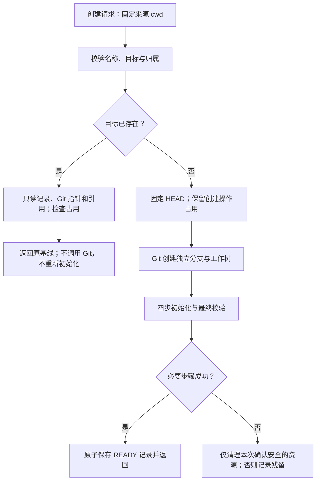
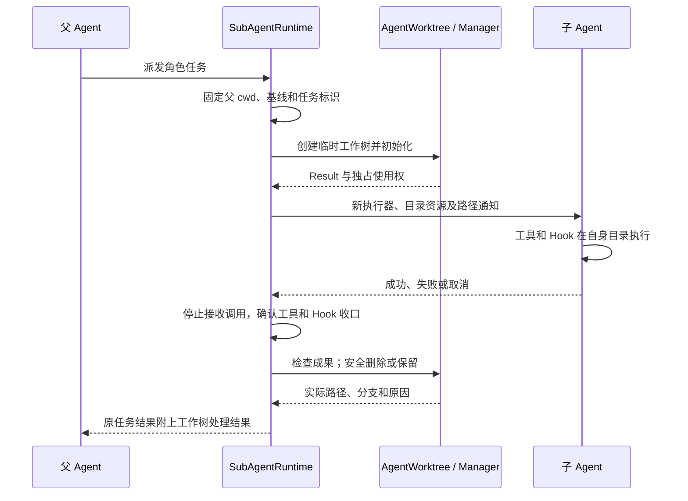

# MewCode Git Worktree Plan

> 状态：已确认；整份技术设计已获用户批准，进入任务拆解阶段。尚未开始实现。
>
> 依据：[已批准的 Spec](spec.md)。参考：[文件系统隔离与 Worktree 管理](https://my.feishu.cn/wiki/GrG8wZQpviiDi8k1hsKcSjtunng)、[Java 实现参考](https://my.feishu.cn/wiki/TUfrwZz1liFgzwkksY6cjEKHnHh)。以参考文档的组件和核心类型为基础，补充满足 Spec 所需的目录隔离与删除保护。

## 架构概览

同一仓库共用资源管理器，每个 Agent 独立持有工作目录和使用状态。每次调用取得不可变目录快照，工具、权限检查与相关 Hook 使用同一快照；运行中的调用不受之后的目录切换影响。

| 组件 | 职责 | Spec 归属 |
|------|------|-----------|
| `WorktreeManager` | 名称校验、创建、文件系统快速恢复、列出、占用和受保护删除的统一入口 | F1、F2、F3、F7、F11、F13 |
| `WorktreeSession` / `WorktreeSessionStore` | 持久化资源归属、创建基线和所属会话的目录使用状态，支持有效目录恢复 | F8 |
| `AgentWorkspace` | 每个 Agent 的当前目录及调用快照；按绝对路径定位文件缓存、提示词、项目指令和项目记忆 | F5、F6、F7 |
| `AgentWorktree` | 接入已有 `SubAgentRuntime`，完成声明隔离的启动、路径通知及任务结束后的处理 | F9、F10 |
| `PostCreationSetup` | 新建后的配置复制、Git Hooks 设置、只读依赖共享及运行文件补充；必要失败阻止启动 | F4 |
| `WorktreeChanges` | 修改、新增提交及未推送提交检查；失败或未知状态阻止默认删除 | F10、F11、F12 |
| `StaleCleanup` | 定期执行临时归属、过期与占用、成果保护三层过滤，复用统一删除入口 | F12 |

主会话的 `/worktree` 命令与 Worktree 工具共用生命周期入口；子 Agent 根据角色的 `isolation: worktree` 自动接入。`AgentWorktree` 是适配层，不复制一套创建、恢复或删除算法，不修改主会话目录。

## 核心数据结构

### WorktreeInfo：列表中的资源信息

沿用参考文档的三个字段，放在 `WorktreeManager` 中。路径使用项目现有的 `Path` 类型，边界处统一转为规范化绝对路径。

```java
record WorktreeInfo(Path path, String branch, Instant createdAt) {}
```

此类型用于列出和展示资源。名称、首次创建基线、手动/临时归属、创建者、最后使用时间和初始化是否完成，由管理器内部资源记录保存。资源记录存放在源码工作树之外，由 `WorktreeSessionStore` 的内部方法持久化，字段和布局见模块设计。

后台清理依赖内部归属和最后使用时间，不凭名称正则或创建时间单独判断是否可删。读取恢复不改目录 mtime，也不更新内部最后使用时间；取得、释放使用权时才更新最后使用时间。

### AgentWorktree.Result：子 Agent 创建结果

沿用参考文档的字段与用途：

```java
record Result(
    Path worktreePath,
    String worktreeBranch,
    String headCommit,
    Path gitRoot) {}
```

`headCommit` 固定表示首次创建基线。恢复时从内部资源记录取出原基线，读取当前 HEAD 仅用于验证目录，不将当前 HEAD 填回基线。基线缺失或归属不明时明确拒绝恢复。

子 Agent 使用此结果构造自己的执行器和目录上下文。完成后返回路径、分支和保留原因，任务执行状态沿用现有子任务结果，不另建通用结果协议。

### WorktreeSession：进入前的现场

沿用参考文档的现场字段，补充 `agentId` 以区分使用者：

```java
record WorktreeSession(
    Path originalCwd,
    Path worktreePath,
    String worktreeName,
    String worktreeBranch,
    String originalBranch,
    String originalHeadCommit,
    String sessionId,
    String agentId,
    long creationDurationMs) {}
```

`originalCwd` 用于退出时恢复目录。`originalBranch` 和 `originalHeadCommit` 记录进入前的现场，仅用于说明与恢复验证，不替代资源创建基线，也不要求退出时 checkout 或重置原分支。原目录处于 detached HEAD 时，分支说明允许为空。

使用 Jackson 持久化，沿用参考文档的 snake_case 字段名称。主会话文件按会话标识区分，退出时删除对应记录；子 Agent 不写主会话状态。内存中的当前使用状态属于各自的 `AgentWorkspace`，不设全局当前会话。重启只恢复有效主会话目录，不重新启动子任务。

### ChangeSummary：向用户展示变更

沿用参考文档的两个计数：

```java
record ChangeSummary(int changedFiles, int commits) {}
```

`changedFiles` 包括已跟踪修改和未被忽略的未跟踪文件；`commits` 相对首次创建基线计算。未推送提交由单独方法判断，只使用本地已知远端引用，不 fetch。

计数失败抛出带安全原因的 `WorktreeException`，不返回零。便捷判断 `hasChanges`、`hasUnpushedCommits` 将失败收口为需要保留；实际退出与清理流程保留具体错误原因，用于通知用户。没有可用远端引用同样视为无法确认安全。

### AgentWorkspace 与现有 ToolExecutionContext

保留已确认的 `AgentWorkspace` 职责，调用快照复用现有不可变 `ToolExecutionContext`，不再增加单独的公开 `WorkspaceSnapshot` 类型。

每个 Agent 持有自己的当前 cwd；捕获时将目录传入 `ToolExecutionContext.projectRoot`，并绑定所属 Agent 的文件缓存、取消控制及本次权限上下文。工具与 Hook 不在执行中重新读取全局目录。目录相关提示词、项目指令和项目记忆也按同一绝对目录取得，不在切换时清缓存。

占用与调用计数属于内部生命周期实现：工具提交、异步 Hook 入队前登记，结束、失败或取消时释放。退出保留后，旧调用尚未完成的目录继续受保护。只读共享依赖和必要 Git 写入范围由系统内部推导并交给路径检查和沙箱，模型不能通过参数扩大范围。

## 核心接口

以下为设计签名，不是实现代码。沿用参考的 `create`、`remove`、`list`、`buildNotice` 名称；`create` 包含快速恢复。可能启动 Git 的方法接受现有 `CancellationToken`，统一设置超时及非交互环境。

### WorktreeManager：通用生命周期入口

```java
WorktreeInfo create(Path sourceCwd, String slug, CancellationToken token);
List<WorktreeInfo> list();
WorktreeSession enter(AgentWorkspace workspace, String slug);
void exit(AgentWorkspace workspace, boolean delete, CancellationToken token);
boolean remove(String slug, CancellationToken token);
```

- `create` 新建时冻结来源目录 HEAD，再创建并初始化；已有目录只读文件系统，不调用 Git、不初始化、不改变基线。目录无效、归属不明或已被占用时拒绝。
- `enter` 验证资源可用且能独占使用，再保存现场并绑定所属 Agent 的 cwd。已进入工作树的主会话需先退出，避免覆盖返回现场；在当前目录创建其他资源仍可执行。
- `exit(delete=false)` 恢复原 cwd，释放所属会话占用；`exit(delete=true)` 先做变更和占用保护。保护拒绝时，目录、分支和会话记录不变。
- `remove` 默认受保护，只处理无人使用的系统管理资源。返回 `true` 必须确认目录与分支均已删除；拒绝、失败或部分残留抛出 `WorktreeException`，附路径、分支及可操作原因。
- 用户明确丢弃的例外由内部受信入口处理，复用现有用户命令来源或权限确认机制，并绑定具体目标。模型的 `discardChanges` 参数仅表达意图，不能产生授权；非交互权限模式不授予丢弃权。自动清理始终使用默认保护入口。

名称校验由 `SlugValidator` 处理，内存资源沿用参考的有序 Map。状态登记与竞争判定使用短锁；Git 耗时阶段保留操作占用，不持有全局状态锁，避免单个超时拖住其他资源操作。

### AgentWorktree：子 Agent 的轻量入口

```java
Result create(
    Path parentCwd, String slug, String headCommit, CancellationToken token);
boolean remove(Result result, CancellationToken token);
String buildNotice(Path parentCwd, Path worktreeCwd);
```

`headCommit` 由可信运行时在派发请求时固定，不由模型提供。`create` 委托管理器内部共用创建核心，以临时归属登记资源；完成必要初始化并取得占用后才启动任务。失败抛出包含实际残留位置的异常，不退回父目录执行。

`remove` 复用同一删除保护，不改变主会话状态。子任务成功、失败和取消后，运行时先确认工具和相关 Hook 结束，再检查成果并调用此入口；存在变更、检测失败或无法确认停止状态时保留。清理使用独立且有超时的取消控制，清理失败不覆盖任务结果。

`buildNotice` 沿用父目录、子目录、路径转换和重新读取说明，提示词不代替实际路径限制。

### AgentWorkspace

```java
Path currentCwd();
Optional<WorktreeSession> currentSession();
ToolExecutionContext capture(CancellationToken token);
```

目录仅由生命周期入口修改。生命周期工具自身的旧目录调用及相关 Hook 结束后，才能提交删除该目录的动作，最终结果在实际提交后发布。其他运行中或已入队的调用继续阻止删除；具体顺序在模块交互中展开。

### 初始化、变更检查与后台回收

```java
// PostCreationSetup：必要失败抛异常，返回可选项的安全提示。
List<String> perform(Path sourceCwd, Path worktreePath, CancellationToken token);

// WorktreeChanges：判断失败保留；计数失败抛出带原因的异常。
boolean hasChanges(Path worktreePath, String headCommit, CancellationToken token);
ChangeSummary countChanges(Path worktreePath, String headCommit, CancellationToken token);
boolean hasUnpushedCommits(Path worktreePath, CancellationToken token);

// StaleCleanup：返回实际清理数量，其余候选保留并记录原因。
int cleanup(Instant now, CancellationToken token);
```

初始化沿用配置、Hooks、软链、include 文件四步，必要失败阻止启动，可选失败提示。清理沿用三层过滤结构，但使用资源归属记录、最后使用时间及完整成果检查；默认每 30 分钟扫描、24 小时过期。

### WorktreeSessionStore：保存与恢复现场

```java
void save(Path repoRoot, WorktreeSession session) throws IOException;
Optional<WorktreeSession> load(Path repoRoot, String sessionId) throws IOException;
void clear(Path repoRoot, String sessionId) throws IOException;
```

主会话文件按标识区分，写入采用原子替换。损坏或不可信状态明确报错。内部资源记录另行持久化，只在目录及分支实际清理完毕后移除；部分失败保留记录并更新真实残留。持久化使用状态不代替实时占用，恢复须重新验证并取得使用权。

角色定义增加内部 `IsolationMode.NONE` / `WORKTREE`，默认 `NONE`；frontmatter 接受省略字段或 `isolation: worktree`，其他值按无效角色处理。Fork 式 SubAgent 和 Skill fork 不增加隔离参数。

## 与参考文档的必要差异

| 参考细节 | 本设计处理 | 已确认依据 |
|----------|------------|------------|
| 全局当前 session、固定会话文件 | 每个 Agent 独立 cwd，主会话文件按标识区分 | F5、F7、F8、N2 |
| 恢复刷新 mtime、返回当前 HEAD | 恢复只读并返回首次基线，使用时更新内部时间 | F3、F8 |
| `-B`、默认强制删除 | 不重置已有分支，默认删除受保护 | F3、F11、N4 |
| 正则判断临时目录、`-uno` | 验证系统归属，检查未跟踪文件 | F11、F12 |
| 全部初始化 best-effort | 必要失败阻止启动，可选失败提示 | F4、N6 |
| 设置共享 `core.hooksPath` | 保持主目录和其他工作树行为，具体设置在技术决策中展开 | F4 |

不新增独立的 `WorktreeResult`、`WorktreeOutcome`、`ResourcePresence` 等通用协议，展示与回流复用现有结果机制。所有失败和部分删除仍须包含真实残留及保留原因。

## 模块设计

### 资源记录与存放区域

`WorktreeManager` 的存放区域固定在启动项目目录下，不随当前 cwd 移动：

```text
<repositoryRoot>/.mewcode/
├── worktrees/<flatSlug>/                 工作树代码副本
└── worktree-state/
    ├── resources/<flatSlug>.json         资源归属与创建基线
    ├── sessions/<sessionId>.json         主会话进入现场
    └── locks/<flatSlug>.lock             跨进程占用锁
```

`SlugValidator` 沿用参考的斜杠转 `+` 编码，将嵌套名称映射成单个安全目录名；用户输入字符集不包含 `+`，编码不会因斜杠替换而产生同名碰撞。名称校验同时覆盖最终 Git 分支规则，恢复时使用相同的纯本地校验，不运行 `git check-ref-format`。

资源记录由 `WorktreeSessionStore` 内部读写，字段如下：

| 字段 | 用途 |
|------|------|
| `recordId`、`version` | 此次创建的唯一身份及格式版本，避免旧授权误用于后来同名的资源 |
| `slug`、`path`、`branch` | 已验证名称、绝对目录和独立分支 |
| `sourceCwd`、`baseCommit` | 首次来源目录及固定提交基线 |
| `gitCommonDir`、`gitDir` | 共享版本库及本工作树管理目录；部分创建失败时后者允许尚未确定 |
| `temporary`、`createdBySessionId`、`createdByAgentId` | 系统临时归属及创建者，子任务创建时登记，不靠名称识别 |
| `createdAt`、`lastUsedAt` | 创建与最后使用时间 |
| `state` | `INITIALIZING`、`READY`、`PARTIAL`；初始化未完成或部分清理后不能正常进入 |
| `sharedDirectories`、`hooksPath`、`hooksConfigurationMode` | 验证后的共享依赖及 Git Hooks 运行设置，供恢复时读取 |
| `directoryPresent`、`branchPresent`、`lastError` | 部分失败后的实际残留和安全原因；不能确认时记录未知，不伪造不存在 |

记录、锁文件和存放区域不允许通过符号链接替换。普通文件工具与命令不能修改资源记录；加载时重新验证目录、Git 指针、分支、基线及仓库归属，不因为存在 JSON 就信任其权限。

新建流程为上述管理区域及 MewCode 自身上下文输出登记精确的 Git 忽略规则，优先保留已有规则，缺失时补入共享 Git 的 `info/exclude`。不忽略整个 `.mewcode`，不覆盖用户规则；已被跟踪的管理区域视为冲突并拒绝使用。常规搜索按实际管理区域排除，进入工作树后仍正常搜索当前副本。

新建完成前验证管理区域确实被忽略；项目中优先级更高的否定规则造成冲突时，返回需要调整规则的错误，不擅自改写已跟踪的 `.gitignore`。管理操作错误采用阶段、退出码、目标路径和安全原因，不把 Git 的原始 stderr 或配置值直接拼到日志和任务通知里。

### 占用与生命周期保护

内存有序 Map 保存已知资源和操作状态；短锁登记创建、进入和删除意图，耗时 Git 操作在锁外运行。同名操作发现已有占用就返回冲突，不等待全局锁或接管其他任务。

每个管理资源使用独立的文件锁。会话或子任务占用期间持有排他锁；同进程通过管理器的所属 Agent 和引用计数区分会话占用、工具使用与 Hook 使用，跨进程通过文件锁排除竞争。进程退出后，操作系统释放锁；磁盘上的旧使用记录不能单独证明仍在运行。

已有目录的恢复分支只读取资源记录、`.git` 指针、管理目录的 `HEAD`、`commondir` 及引用文件，并做只读占用探测。不创建锁文件、不补写记录、不刷新 mtime、不启动 Git；必要记录或锁文件缺失时拒绝恢复。进入是独立的取得使用权步骤，可以更新使用时间和所属会话状态。

删除先保留操作占用，阻止新的使用者，再检查归属、使用计数、修改和提交。默认仅调用非强制删除；用户丢弃例外必须绑定 `recordId` 并通过可信入口验证，不能绕过其他使用者、Git 锁或未知状态。目录删除后分支删除失败时保留 `PARTIAL` 记录和分支原因；原目录已经不存在的主会话恢复原 cwd，不能继续显示位于已删除目录。

### 目录相关资源与现有组件

`AgentWorkspace` 每个 Agent 一份，不共享当前 cwd。目录资源按规范化绝对路径取得，同一目录的资源可复用；正在使用的旧资源不会因为切换被关闭或清空。

| 现有组件 | 接入方式 |
|----------|----------|
| `ToolExecutor`、`ToolExecutionContext` | 提交每次调用前捕获目录，后续校验、执行及 Hook 沿用该快照 |
| `PermissionContext`、`PermissionGate`、`PathGuard` | 使用同一目录和内部隔离范围；原权限规则继续生效，隔离范围不能被外部路径授权或非交互模式扩大 |
| `PromptRequestFactory`、`PromptBuilder`、`InstructionLoader` | 每次模型请求从对应目录资源取得提示词和指令；已发出的请求不被切换改写 |
| `SkillCatalog`、`AgentCatalog` | 项目定义从当前副本加载，用户定义保持原作用范围；隔离任务启动后使用已经选定的角色 |
| `MemoryManager` | 项目存储按 cwd 区分；异步更新提交时固定目标，不能结束时再读取当前 cwd。用户存储按绝对目录共用写锁，避免多个目录实例同时覆盖 |
| `ContextManager`、`ToolResultExternalizer` | 保留所属 Agent 的对话与预算状态，按调用目录选择结果外置目录，不调用会重置预算的 `resetForSession` 来实现工作树切换 |
| `SessionManager` | 对话历史仍保存在原主会话目录，进入状态单独保存；工作树内部不复制完整会话历史 |
| `HookEngine`、`HookInvocation`、`CommandRunner` | 捕获 cwd、运行设置与占用后再入队，取消不等于实际结束；释放以真实任务收口为准 |

文件已读记录依旧属于每个 Agent。父 Agent 的缓存与同名文件不能授予子 Agent 编辑权限。用户级 Memory 保持既有范围；子 Agent 本期只读取索引，不新增后台自动写入。

## 模块交互

### 创建与快速恢复



冻结基线发生在创建请求的入口，子任务异步排队前完成；不能等后台任务真正启动时再读取父分支 HEAD。新建使用明确的提交 SHA 和小写 `-b`，不使用 `-B`。

初始化依次处理本地配置、Hooks 设置、依赖软链、包含文件，并在四步完成后统一验证必要资源。配置采用本项目实际的 `.mewcode/config.yaml`、本地权限及 Hooks 文件；存在时复制失败阻止使用。可通过 `requiredFiles` 声明额外必要文件，缺失时同样失败。不存在的可选文件产生提示，不自动安装依赖。

复制和软链都验证真实源、目标和父目录，不覆盖已检出的源码；复制的访问权限不比源宽。`.worktreeinclude` 只补充被 Git 忽略且命中规则的文件，Git 元数据、管理区域和会话历史始终排除。配置正文及凭据不进入错误信息。

### 主会话进入与退出

进入顺序为：校验资源可用 → 取得独占使用权 → 加载目标目录资源 → 原子保存进入现场 → 绑定所属 `AgentWorkspace` → 更新目录与分支显示。保存失败则释放此次占用，原会话位置不变。

保留后退出先准备原目录资源、清除相应恢复记录，再提交 cwd 切换；旧调用继续使用旧快照。旧目录还有调用或 Hook 时，其使用权仍受保护，不能被其他 Agent 接管或被删除。

退出并删除先验证使用者为当前会话、没有其他调用或 Hook，并执行完整成果保护。保护拒绝时不切换 cwd、不清除现场、不改变目录或分支。检查通过后执行删除，全部成功再清除资源记录；部分失败按真实残留更新，不报告成功。

Worktree 工具在工具批次中作为串行屏障。对会删除当前目录的动作，采用以下明确顺序：

1. 捕获旧目录，执行现有策略、权限及 `PreToolUse` 检查。
2. 管理器完成预检并保留操作占用，工具内部结果标为“已准备，尚未提交”。
3. `PostToolUse` 接收该准备状态，在旧目录运行；相关异步 Hook 尚未结束则保留并拒绝提交。
4. 释放该控制调用的旧目录使用，重新检查占用及成果，提交退出/删除。
5. 对模型和 UI 发布实际最终结果，不把准备状态误报为删除成功，也不在已删除目录再派发一次 Post Hook。

普通工具仍保持现有 Pre/执行/Post 顺序。控制动作的两阶段处理仅用于当前目录生命周期，失败保留及检查结果通过现有 `ToolResult` 回流。

### 隔离子 Agent 启动、执行与收尾



任务标识在创建前取得，用于唯一临时名称和资源归属。未声明隔离的角色保持旧流程；无效隔离字段只使该角色无效。隔离创建、初始化或上下文加载失败时不执行任何子任务工具。

子 Agent 创建自己的 `ToolExecutor`、文件缓存、项目提示词、Memory 索引和结果目录，不能直接复用父环境段。通知说明父路径如何转换为本地路径以及编辑前重新读取。

调整 `SubAgentTaskManager` 的完成顺序：先冻结原执行结果，在线程池中运行有界收尾；收尾完成或明确决定保留后，才发布完成 Future 与后台通知。管理器状态锁不包围 Git、进程等待或 Hook 收口。成功、失败和取消都走此路径，收尾最多执行一次，清理错误只追加说明，不改变原任务终态。

启动阶段同样在状态登记后由工作线程执行目录创建与运行工厂，不在任务管理器或 TUI 的状态锁中运行 Git。启动失败也收口到一次实际资源处理和原任务失败结果。

本任务退出工作树时释放自己的会话占用；工具与 Hook 的实际使用计数未归零仍阻止删除。`Future.cancel`、`AgentRun.close` 或 Hook 队列移除都不能直接证明底层进程已经结束。超时后无法确认停止时，记录保留原因，允许原任务正常返回。

### 工具调用、项目上下文与路径边界

一次调用的目录快照先于权限检查、参数校验和 Hook 取得；权限根、Hook cwd、命令 cwd、外置结果路径均来自该次快照。普通工具只在调用开始读取目录一次，不在执行中追随主会话切换。

混合工具批次按原调用顺序分段：安全读操作可并行，遇到 Worktree 或 Agent 派发先收口前段，再串行处理边界动作。后段调用捕获新的目录；子任务在自身派发入口固定基线，不能被普通工具与 Agent 工具分组重排影响。

隔离范围优先于可询问的项目外路径权限：子 Agent 对父源码的绝对路径或符号链接写入直接拒绝；共享依赖只允许读与执行。主会话在原目录工作时，工作树存放区也是普通写入和搜索的排除区域，进入对应资源后才能按所属目录操作。管理器修改管理区域通过受控生命周期入口完成。

Bash、Skill 脚本及 Shell Hook 的沙箱使用同一范围。隔离模式的 Skill 脚本以 Agent cwd 运行，脚本及附属资源以绝对路径定位，并提供 `MEWCODE_SKILL_DIR`；未隔离时保留现有脚本协议。不能为了运行旧脚本而回退到父项目目录。

当前 MCP 包装器不使用调用 cwd，已启动服务可能继续操作原项目。工作树会话默认不暴露和执行未提供可验证目录隔离的 MCP 工具；本期不新增 MCP 按目录重启或服务池。普通未隔离会话的 MCP 行为保持原样。隔离子 Agent 也不开放手动 Worktree 切换工具，目录由自己的自动生命周期管理。

### 后台清理

调度器每 30 分钟触发一次后台扫描，同一时刻最多一个扫描任务；过期阈值默认 24 小时，均可配置。扫描读取资源列表后逐项执行：

1. 资源记录、实际目录和 Git 指针一致，且能证明是系统创建的临时工作树。
2. 超过最后使用时间阈值，能取得排他操作占用，没有会话、工具、Hook 或其他进程使用。
3. 已跟踪修改、未被忽略的未跟踪文件、新增提交及未推送提交都确认无成果。

任一步失败或未知就保留该资源，继续处理其他候选。通过者调用统一非强制删除，不进行提交、推送、fetch、分支重置或全局 prune。手动资源永远不成为自动候选。

## 文件组织

### 新增文件

以下路径相对仓库根目录。资源记录、占用计数、准备删除的操作对象均保留为内部类型；不新增通用工作区框架或另一套结果协议。

```text
src/main/java/com/mewcode/
├── worktree/
│   ├── SlugValidator.java         名称、分支格式、编码及存放路径校验
│   ├── WorktreeSession.java       主会话进入前的现场
│   ├── WorktreeSessionStore.java  会话与资源记录的安全读取、原子持久化
│   ├── WorktreeManager.java       创建、恢复、占用、进入退出及受保护删除
│   ├── AgentWorkspace.java        每个 Agent 的 cwd、调用占用与绝对路径资源表
│   ├── AgentWorktree.java         子任务自动隔离适配与路径说明
│   ├── PostCreationSetup.java     配置、Git Hooks、依赖软链与 include 四步初始化
│   ├── WorktreeChanges.java       修改、新增提交与未推送提交检查
│   ├── StaleCleanup.java          三层过滤及统一删除入口
│   ├── GitCommandRunner.java      包内 Git 参数数组、显式 cwd、超时及取消
│   └── WorktreeException.java     安全失败原因、残留路径与分支
├── config/WorktreeConfig.java     可选配置、默认值及边界校验
└── tool/impl/WorktreeTool.java    主会话自然语言请求的生命周期工具
```

`WorktreeInfo` 嵌套在 `WorktreeManager`，`Result` 嵌套在 `AgentWorktree`，`ChangeSummary` 嵌套在 `WorktreeChanges`；`IsolationMode` 嵌套在现有 `SubAgentSpec`。`AgentWorkspace` 内部按绝对 cwd 保存目录资源，不另外建立公开的快照或缓存管理模块。Git 文件的只读解析放在资源存储中，不借用 Git 子进程完成恢复。

依赖方向如下：

```text
MewCodeModel / SubAgentRuntime / WorktreeTool
        │
        ├── AgentWorkspace
        ├── AgentWorktree ──┐
        ├── StaleCleanup ──┤
        └──────────────────┴── WorktreeManager
                                ├── SlugValidator
                                ├── WorktreeSessionStore
                                ├── PostCreationSetup ──┐
                                ├── WorktreeChanges ────┼── GitCommandRunner
                                └───────────────────────┘
```

管理器可绑定 `AgentWorkspace` 的目录与占用；工作区通过注入的窄幅调用占用接口登记使用，不反向依赖管理器的创建、初始化或删除 API。初始化、成果检查、资源存储均不调用上层运行时；后台调度由 `MewCodeModel` 持有，管理器不依赖清理器。普通命令执行器不调用生命周期服务，只读取调用快照中的 cwd、环境设置和范围。

### 现有文件的接入

表中的路径位于 `src/main/java/com/mewcode/`；修改范围限定为前文设计的接入点，不重写这些组件已有功能。

| 文件 | 需要接入的内容 |
|------|----------------|
| `MewCode.java`、`tui/MewCodeModel.java` | 注入可选配置，创建主工作区与共享管理器，注册主会话工具，后台执行生命周期请求，显示当前目录及分支，管理扫描器的启动和关闭 |
| `config/AppConfig.java`、`config/ConfigLoader.java` | 绑定可选 worktree 配置并校验；不配置时沿用默认值 |
| `command/CommandRegistry.java`、`command/CommandContext.java` | 注册 `/worktree`，通过窄幅回调提交主会话请求；保留已有构造兼容性，Git 操作不在 UI 锁内执行 |
| `subagent/SubAgentSpec.java`、`subagent/AgentDefinitionParser.java` | 定义并解析 `isolation`；未知值仅使所属角色无效 |
| `subagent/SubAgentRuntime.java`、`subagent/SubAgentTaskManager.java` | 派发时固定 cwd、基线及任务标识，在状态锁外启动；隔离初始化成功后运行，收尾后再发布完成结果 |
| `agent/AgentTurnCoordinator.java`、`agent/PromptRequestFactory.java`、`agent/ToolPolicy.java` | 按原工具顺序处理切换与派发边界，从当前目录资源构造请求；隔离子任务禁止手动切换，工作树调用拦截无法验证隔离的 MCP 工具 |
| `tool/ToolExecutor.java`、`tool/ToolExecutionContext.java`、`tool/ToolInvocationResult.java` | 捕获并沿用调用目录、内部范围及占用；接入生命周期工具的准备、Hook 收口和最终提交，保持普通工具结果协议 |
| `tool/support/PathGuard.java`、`permission/PermissionContext.java`、`permission/PermissionGate.java`、`permission/PathSandbox.java` | 在可询问权限之前落实不可扩大的隔离边界，保留真实路径及符号链接检查 |
| `tool/impl/ReadFileTool.java`、`tool/impl/EditFileTool.java`、`tool/impl/WriteFileTool.java` | 路径检查使用本次调用快照及范围，继续使用所属 Agent 的绝对路径已读记录 |
| `tool/support/SearchSupport.java`、`tool/impl/GlobTool.java`、`tool/impl/GrepTool.java` | 按实际管理区域排除父目录搜索，使用当前副本的搜索根；不能只靠目录名称过滤 |
| `tool/support/CommandRunner.java`、`permission/BashSandboxRequest.java`、`permission/MacSeatbeltSandbox.java`、`permission/LinuxBubblewrapSandbox.java` | Bash、脚本和 Shell Hook 使用固定 cwd、只读共享范围及必要 Git 范围，注入本资源的 Hooks 覆盖设置 |
| `skill/ScriptTool.java` | 隔离脚本以工作树 cwd 运行，脚本与附属资源使用绝对路径和 `MEWCODE_SKILL_DIR` |
| `hook/HookEngine.java`、`hook/HookInvocation.java`、`hook/HookActionExecutor.java` | 入队前固定目录、范围和使用权；在真正结束或确认从未启动时释放，取消标记不替代收口 |
| `memory/MemoryManager.java` | 按目录复用项目实例，异步更新固定目标，对用户级存储共用绝对路径写锁；子任务保持只读索引 |
| `compact/ContextManager.java`、`compact/ToolResultExternalizer.java` | 按调用目录选择外置结果资源，保持同一 Agent 的对话、预算和压缩状态 |

现有 `FileStateCache` 已按绝对路径记录文件状态，保留每个 Agent 的实例并复用其能力；不在切换时复制或清空。`PromptBuilder`、`InstructionLoader`、`SkillCatalog`、`AgentCatalog` 由当前目录资源表创建或取得对应实例。`SessionManager` 继续锚定原主会话目录，不把进入工作树当作新对话。`McpManager` 不增加服务重启或工作树池，隔离限制在现有策略与执行入口实施。

### 入口与配置

主会话工具名称为 `Worktree`，参数仅包含 `action`（`create`、`enter`、`exit`、`list`、`delete`）、目标 `name`、退出时的 `delete` 意图及 `discardChanges` 意图。创建不会隐式进入；模型不能指定来源 cwd、提交基线、资源归属、存放路径或临时标记。该工具不是豁免策略的系统工具，生命周期调用按串行边界执行。未隔离的子 Agent 沿用原有工具策略，不因此获得主会话管理入口。

`/worktree create <name>`、`enter <name>`、`list`、`exit [--delete]`、`delete <name>` 调用同一核心。用户在目标明确的删除请求中输入 `--discard` 才表达可信的丢弃要求；执行前仍绑定本次资源身份并重新检查归属、占用和未知状态。模型传入同名字段不能替代用户授权。斜杠命令和自然语言操作都使用前文的 Hook 与调用收口流程，不另走一条绕过安全检查的删除路径。

在现有项目配置中新增可选 `worktree` 对象，字段如下：

| YAML 字段 | 默认值 | 校验及作用 |
|------------|--------|------------|
| `cleanup_interval_minutes` | `30` | 正整数；后台扫描间隔 |
| `stale_cutoff_hours` | `24` | 正整数；距最后使用的过期阈值 |
| `symlink_directories` | `[]` | 项目内相对目录列表；拒绝绝对路径、空段、点段、管理区域及解引用越界，仅共享读与执行 |
| `required_files` | `[]` | 额外必要运行文件的项目内相对路径；缺失或安全复制失败阻止启动，不覆盖已检出源码 |

默认本地配置仍按前文列出的实际文件名处理；`.worktreeinclude` 为项目根目录中的可选 Git ignore 格式文件。配置项不能扩大共享依赖写权限，也不能把会话历史或 Git 元数据纳入初始化。Git 操作默认使用现有 `ToolExecutionContext.DEFAULT_TIMEOUT` 的 120 秒上限，取消时主动终止并确认子进程；超时不能确认退出则保留资源。后台收尾使用新的取消控制和同样的有界等待。

仅更新 `.mewcode/config.yaml.example` 的可选示例，不改实际 `.mewcode/config.yaml` 或现有角色文件；隔离角色示例和 tmux 使用方法写入本章文档。

### 验证文件

新测试放在 `src/test/java/com/mewcode/worktree/`：`SlugValidatorTest.java`、`WorktreeSessionStoreTest.java`、`WorktreeManagerTest.java`、`AgentWorkspaceTest.java`、`AgentWorktreeTest.java`、`PostCreationSetupTest.java`、`WorktreeChangesTest.java`、`StaleCleanupTest.java`、`GitCommandRunnerTest.java`。共用包内 `GitRepositoryFixture.java` 构造临时真实 Git 仓库，注入可控时钟、Git 调用记录及阶段故障；验证真实目录、分支和提交状态，而不只断言内部调用。

新增 `src/test/java/com/mewcode/tool/impl/WorktreeToolTest.java`；在现有配置、命令、子任务运行时、任务管理器、工具执行器、权限、沙箱、Hook、记忆、上下文和脚本测试文件中补充对应边界回归。重点覆盖恢复零 Git 调用、目录切换期间的固定快照、异步 Hook 阻止删除、取消后进程未结束、结果发布顺序及部分删除残留。

`docs/ch14/task.md` 和 `docs/ch14/checklist.md` 在整份 Plan 批准后依次生成并单独审批；本章运行说明放在 `docs/ch14/README.md`。实现后将 tmux 中真实对话、工具调用、文件落点、结果回流及清理的证据记入 checklist，不能用单元测试替代 AC27、AC28。

## 技术决策

| 决策点 | 选择 | 理由与边界 |
|--------|------|------------|
| Git 接入 | Git CLI + 参数数组，不引入 JGit；管理操作有统一截止时间和取消控制 | 直接使用 Git Worktree；不把模型输入拼成 Shell 命令 |
| 名称与分支 | 名称校验后 `/` 编码为 `+`；独立分支采用 `codex/worktree/<flatSlug>/task` | 沿用参考编码；每个分支有独立 refs 目录，便于只开放自身 Git 写入范围 |
| 新建与恢复 | 新建传冻结 SHA，使用 `-b`；恢复只读持久化记录和 Git 文件 | 不重置冲突分支，不覆盖原基线，已有目录恢复没有 Git 子进程 |
| Git 元数据写入 | 仅当前工作树管理目录、共享 objects、该分支 refs/reflog 命名空间；禁止直接改共享 config 或其他分支 | 支持任务按要求提交，又不开放父源码或其他工作树的管理目录；无法验证布局时拒绝扩大权限 |
| Git Hooks | 优先沿用有效配置；已启用 worktreeConfig 时仅写新工作树配置，否则用工作树命令环境的 Git 配置覆盖 | 不主动启用仓库扩展，不迁移共享设置，不改变主目录及其他工作树行为 |
| Hooks 覆盖的生效范围 | 需要覆盖时保存在资源记录，随该工作树的 Bash、脚本和 Hook 进程注入 | 环境覆盖只影响 MewCode 启动的命令；工作树外部终端仍遵循仓库原有配置，不宣称永久修改了共享配置 |
| include 匹配 | 复用 Git 的 ignore 模式；标准忽略候选与 include 匹配集合取交集，用 NUL 分隔路径 | 避免手写不完整 glob；只复制被忽略的文件，再执行源/目标安全过滤 |
| 配置复制 | 默认复制实际存在的项目配置、本地权限与 Hooks；额外必要文件通过 `requiredFiles` 声明 | 缺失可选文件提示；必要文件缺失或复制失败则停止，不自动装环境 |
| 共享依赖 | `symlinkDirectories` 默认空，显式配置才共享；读取、执行允许，写入由路径检查与 OS 沙箱共同拒绝 | 需要依赖锁文件、安装或更新时选择独立副本，不静默改变父依赖 |
| 目录缓存与预算 | 绝对路径定位资源，每个 Agent 的对话/预算独立；切换不 reset、不清缓存 | 防止父缓存授权子编辑，也避免切换丢失对话预算与先前路径记录 |
| 并发控制 | 短状态锁、每资源文件锁、调用和 Hook 使用计数 | 同名创建/删除有保护，Git 耗时或取消不阻塞其他目录和 UI |
| 成果检测 | Git status 含未跟踪文件；相对原基线检查新增提交；仅查询本地远端引用 | 已推送的新成果仍保留；无远端引用或检测错误不假定安全 |
| 清理与错误 | 默认非强制；必要检查失败保留；部分删除记录真实残留 | 不靠固定 sleep，失败不假报成功；只允许可信用户授权越过已确认的成果保护 |
| 配置与非 Git 兼容 | 新增可选 worktree 配置；首次请求才识别 Git 能力，默认 30 分钟/24 小时 | 原配置继续可用，普通对话不因缺少 Git 或非 Git 项目失败 |
| 外部工具边界 | 无法验证 cwd 隔离的 MCP 工具在工作树会话中拒绝；未隔离时保持旧行为 | 当前包装器忽略 cwd，不能把外部服务能力当成已经隔离 |

Git 默认共享仓库配置，worktreeConfig 扩展涉及版本兼容及特殊字段迁移，因此不在初始化时主动启用。[Git Worktree 配置说明](https://git-scm.com/docs/git-worktree#_configuration_file)

进程环境中的 `GIT_CONFIG_COUNT` / `GIT_CONFIG_KEY_n` / `GIT_CONFIG_VALUE_n` 可提供运行时配置，覆盖文件中的值；注入时保留已有合法条目，并仅追加所需 Hooks 设置。命令显式传入的 `git -c` 仍有更高优先级。[Git 环境配置说明](https://git-scm.com/docs/git-config#_environment)

`git ls-files --exclude-from` 使用 Git ignore 格式的规则，适合复用 `.worktreeinclude` 匹配，不需要增加第三方匹配库。[Git ls-files 排除规则](https://git-scm.com/docs/git-ls-files#_exclude_patterns)

## 设计自检

本节为设计覆盖检查，尚未执行实现测试。

| 检查项 | 结论与对应位置 |
|--------|----------------|
| 功能覆盖 | F1～F13 均在架构表中有归属；创建与恢复、四步初始化、目录资源、手动管理、状态恢复、自动隔离、收尾、删除及清理流程均已展开，无功能缺口 |
| 接口完整性 | 核心公开类型与接口、异常、内部资源字段、占用及退出事务、主会话入口和可选配置已定义；实现细项由下一阶段任务拆解落实 |
| 依赖清晰度 | 运行时与入口调用管理器；管理器依赖校验、存储、初始化、成果检查与 Git 执行；初始化及成果检查不反向调用管理器，清理器只复用管理器删除 |
| 需求与决策一致 | 已有目录恢复仅文件系统读取；默认保护未知状态与成果；隔离范围先于可询问权限；不自动合并、同步、提交、推送或恢复子任务执行 |

| 非功能需求 | 设计及计划验证位置 |
|------------|--------------------|
| N1 隔离完整性 | 目录快照、绝对路径资源、搜索排除、脚本及沙箱范围；AC7、AC9～AC11 |
| N2 并发一致性 | 每资源锁、会话与调用占用、按原序处理切换及派发；AC4、AC13 |
| N3 安全边界 | 原策略与权限保留、不可扩大的路径范围、可信丢弃授权、MCP 限制；AC7、AC18、AC23 |
| N4 清理保留 | 三层过滤、未知状态拒绝、非强制入口及部分残留；AC19、AC20、AC22 |
| N5 初始化安全 | 源目标及真实路径检查、排除管理区域、权限保留及安全错误；AC5、AC24 |
| N6 失败可靠 | 初始化状态、仅回滚本次资源、部分失败记录和最终结果发布；AC8、AC22 |
| N7 运行不阻塞 | Git 截止时间与取消、锁外启动和收尾、单后台扫描；AC16、AC25 |
| N8 兼容现有行为 | 可选配置、未隔离协议、原主会话历史、延迟 Git 检测；AC11、AC15、AC26 |
| N9 清理可配置 | 两项正整数配置及可控时钟；AC21 |
| N10 实际验证 | 临时真实 Git 仓库、相关回归及真实 MewCode tmux 对话；AC26～AC28 |
