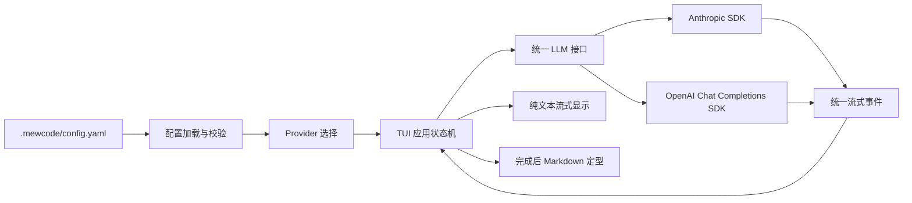
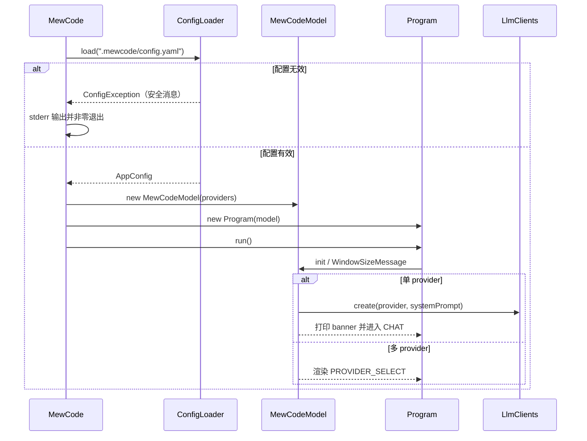
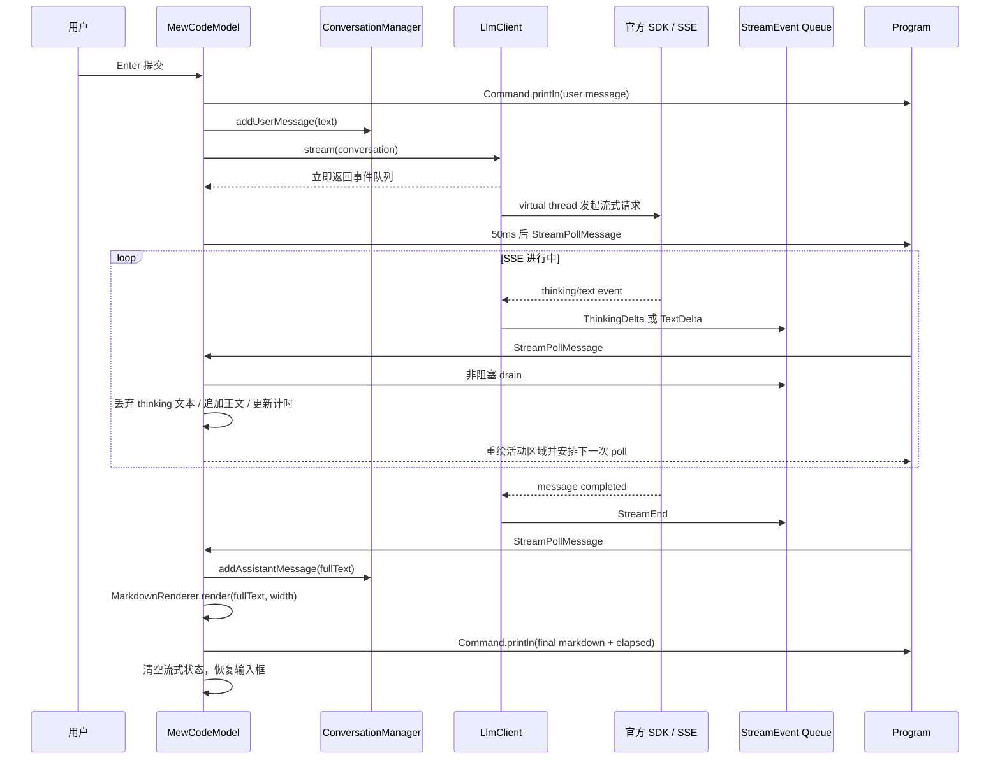
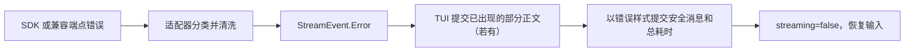
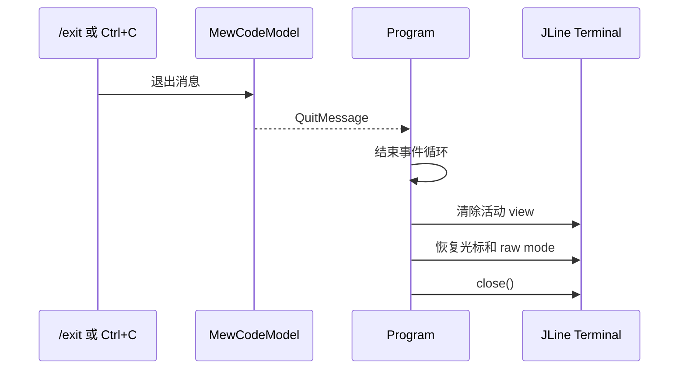

# 多协议 LLM 终端对话客户端 Plan

## 架构概览

采用参考项目的裁剪版分层结构，只保留纯对话所需组件。

1. **入口层 `MewCode`**  
   确定项目配置路径，加载并校验配置，创建应用模型与终端运行时。配置失败时输出安全、可读的启动错误。

2. **配置层 `config`**  
   将 YAML 映射为强类型配置，校验 provider 列表、六个字段、名称唯一性和协议值。只读取当前工作目录下的 `../../.mewcode/config.yaml`。

3. **会话层 `conversation`**  
   保存当前进程内的纯文本用户/助手消息，为 provider 提供不可修改的历史快照。

4. **Provider 层 `llm`**  
   定义协议无关的流式接口与统一事件。Anthropic 适配器使用官方 SDK；OpenAI 适配器使用官方 SDK 的 Chat Completions 流式接口，同时覆盖官方地址和自定义兼容端点。两个客户端均关闭 SDK 自动重试并显式关闭流响应。

5. **TUI 运行时层 `tui.tea`**  
   沿用仓库现有的 `Program + Model + Command + Message` 架构，负责 raw mode、按键解析、窗口变化、事件队列、定时消息和增量重绘。

6. **TUI 应用层 `tui`**  
   `MewCodeModel` 维护 provider 选择、输入、多轮历史、等待与流式状态；通过定时消息非阻塞消费 provider 事件，处理计时、错误恢复和退出。

7. **展示层**  
   统一负责 banner、样式和 Markdown。流式期间显示纯文本，结束后使用 Mordant `Markdown` widget 按终端宽度渲染。



需求归属：

- F1–F3：入口、配置、Provider 层。
- F4–F6、F11–F12：会话、Provider、TUI 应用层。
- F7–F10：TUI 运行时、TUI 应用、展示层。
- N8–N9：统一 LLM 接口及无 Agent、工具概念的模块边界。

## 核心数据结构与接口

### 配置层

沿用参考草案的 JavaBean 与 SnakeYAML 直接绑定方式。

```java
package com.mewcode.config;

public class ProviderConfig {
    private String name;
    private String protocol;   // "anthropic" | "openai"
    private String baseUrl;    // 空时使用 SDK 默认地址
    private String apiKey;
    private String model;
    private boolean thinking;

    // 标准 getter / setter
    // toString() 必须隐藏 apiKey
}

public class AppConfig {
    private List<ProviderConfig> providers;

    // 标准 getter / setter
}

public final class ConfigLoader {
    public static AppConfig load(String path) throws ConfigException;

    public static class ConfigException extends Exception {
        public ConfigException(String safeMessage);
    }
}
```

约束：

- YAML 的 `anthropic`、`openai` 直接保留为字符串协议值，不增加 `openai-compat`。
- `thinking` 缺省为 `false`，仅 Anthropic 适配器使用。
- `base_url` 缺失、空字符串或全空白时使用 SDK 默认地址。
- `api_key` 必须来自 YAML 原值。
- `ProviderConfig.toString()` 始终将密钥显示为 `[REDACTED]`。

### 会话层

```java
package com.mewcode.conversation;

public record Message(String role, String content) {}

public class ConversationManager {
    public void addUserMessage(String text);
    public void addAssistantMessage(String text);
    public List<Message> getMessages();
}
```

`getMessages()` 返回不可修改的快照。历史只存在当前进程内，不包含 thinking、错误、界面状态或 ANSI 样式。

### LLM 层

```java
package com.mewcode.llm;

public sealed interface StreamEvent {
    record TextDelta(String text) implements StreamEvent {}
    record ThinkingDelta(String text) implements StreamEvent {}
    record StreamEnd(String stopReason) implements StreamEvent {}
    record Error(String message) implements StreamEvent {}
}

public interface LlmClient {
    BlockingQueue<StreamEvent> stream(ConversationManager conversation);
}

public final class LlmClients {
    public static LlmClient create(
            ProviderConfig provider,
            String systemPrompt
    );
}
```

流式约束：

- `stream()` 每次创建一个 virtual thread 和有界 `LinkedBlockingQueue`。
- 调用线程立即取得队列，不阻塞 TUI。
- 适配器在 virtual thread 中使用官方 SDK 消费 SSE。
- `ThinkingDelta` 只用于识别 extended thinking；TUI 收到后立即丢弃文本，不加入正文、界面历史或会话历史。
- 正常结束写入一个 `StreamEnd`；异常写入一个已清洗的 `Error`。
- 不保留工具事件、token 用量或动态修改 system prompt 的接口。

工厂分派规则：

- `anthropic` → `AnthropicClient`。
- `openai` → `OpenAiClient`。
- 其他值在配置加载阶段拒绝。

### TUI 框架层

沿用当前已有接口，仅补足后台消息和输入解析。

```java
package com.mewcode.tui.tea;

public interface Message {}

public record KeyPressMessage(String key, char[] runes) implements Message {}
public record WindowSizeMessage(int width, int height) implements Message {}
public record QuitMessage() implements Message {}

public sealed interface Command {
    static Command tick(Duration delay, Function<Instant, Message> fn);
    static Command println(String text);
    static Command checkWindowSize();
    static Command batch(Command... commands);
}

public interface Model {
    Command init();
    UpdateResult<? extends Model> update(Message message);
    String view();
}
```

`MewCodeModel` 使用嵌套的 `StreamPollMessage`。每次收到该消息时非阻塞地排空当前流队列，同时推进 spinner 和刷新耗时：

- `ThinkingDelta`：丢弃文本，保持进行中状态。
- `TextDelta`：追加到流式缓冲。
- `StreamEnd`：保存完整正文，执行 Markdown 定型，恢复输入。
- `Error`：展示错误并恢复输入。
- 队列尚未结束：安排下一次短间隔轮询。

### TUI 应用状态

```java
package com.mewcode.tui;

public enum AppState {
    PROVIDER_SELECT,
    CHAT
}

public class ChatMessage {
    private final String role;       // user | assistant | error
    private final String content;
    private final double elapsedSeconds;
}

public class MewCodeModel implements Model {
    // providerCursor、selectedProvider
    // ConversationManager、LlmClient
    // inputBuffer、inputCursor
    // chatMessages、streamBuffer
    // streaming、thinkingStartMs、elapsedSeconds
    // width、height
}
```

`CHAT` 内使用 `streaming` 区分空闲与生成中，不再引入额外状态类型。程序不存在 `RESUME`、Agent、工具块、权限弹窗或 slash 菜单。

### Prompt 与 Markdown

```java
package com.mewcode.prompt;

public final class PromptBuilder {
    public static String buildSystemPrompt();
}
```

```java
package com.mewcode.tui;

public final class MarkdownRenderer {
    public static String render(String markdown, int width);
}
```

`MarkdownRenderer` 保留参考草案中的调用形式，内部使用 Mordant `Markdown` widget 的 `render(terminal, width)` 得到布局结果，再由 Mordant `Terminal.render(...)` 转成 ANSI 字符串，不直接写标准输出。

## 模块设计

### `config` 模块

**职责：** 从固定路径读取、绑定并校验 YAML 配置。

**对外接口：** `ConfigLoader.load(String path)`、`AppConfig.getProviders()`、`ProviderConfig` 六字段 getter/setter。

**行为：**

- 入口固定传入 `../../.mewcode/config.yaml`。
- SnakeYAML 将 snake_case 字段绑定到 JavaBean。
- 校验 `providers` 存在且非空。
- 每项校验 `name`、`protocol`、`model`、`api_key` 非空。
- `base_url` 允许省略或留空；非空时必须是合法 HTTP/HTTPS 地址。
- `protocol` 只允许 `anthropic` 或 `openai`。
- provider 的 `name` 不得重复。
- `thinking` 缺失时取 `false`。
- 所有错误包含配置项索引和字段名，但不得包含字段值中的密钥。
- 不读取环境变量、用户目录配置或命令行覆盖。

**依赖：** SnakeYAML、JDK 文件与 URI API。

### `conversation` 模块

**职责：** 保存当前进程内的纯文本对话上下文。

**对外接口：** `addUserMessage`、`addAssistantMessage`、`getMessages`。

**行为：**

- 用户提交后立即追加 user 消息。
- 模型正常完成后追加 assistant 消息。
- 调用失败时不追加 assistant 消息，界面错误也不进入模型历史。
- 后续 Anthropic 请求遇到连续 user 消息时，在请求映射阶段合并为一条，保证协议兼容。
- `getMessages()` 返回副本，禁止外部修改内部列表。
- 不保存 thinking、计时、Markdown ANSI、错误信息或 provider 信息。

**依赖：** 无外部依赖。

### `prompt` 模块

**职责：** 提供本阶段固定的内置 system prompt。

**对外接口：** `PromptBuilder.buildSystemPrompt()`。

**内容边界：**

- 声明 MewCode 是终端中的编程对话助手。
- 要求回答清晰、可使用 Markdown。
- 不声称拥有工具、文件访问或命令执行能力。
- 不读取环境、记忆、技能或项目指令文件。
- 每次请求由 provider 适配器以对应协议的 system 位置注入。

**依赖：** 无。

### `llm` 模块

**职责：** 提供统一流式接口，并将两家协议映射为统一 `StreamEvent`。

#### `AnthropicClient`

- 使用官方 Anthropic Java SDK。
- `api_key` 写入客户端认证配置；`base_url` 非空时覆盖默认地址。
- 显式设置 SDK 最大重试次数为 `0`。
- 将 system prompt 写入 Anthropic system 字段。
- 将会话历史映射为 Anthropic user/assistant 消息；连续同角色消息合并。
- 普通模式使用内部 `max_tokens=8192`。
- thinking 模式使用内部 `max_tokens=16384` 和 `budget_tokens=8192`。
- 使用 `createStreaming(...)` 获取 SSE 流，并用作用域关闭。
- `text_delta` → `TextDelta`。
- `thinking_delta` → `ThinkingDelta`，不累计、不保存签名。
- `message_stop` → `StreamEnd`。
- SDK 错误分类后 → `Error`。

#### `OpenAiClient`

- 使用官方 OpenAI Java SDK 的 Chat Completions 流式接口，不使用 Responses API。
- `base_url` 为空时使用官方地址；非空时覆盖，以接入兼容端点。
- 显式设置 SDK 最大重试次数为 `0`。
- 将 system prompt 作为首条 system 消息。
- 将完整 user/assistant 历史映射到 `messages`。
- 不设置 thinking 或 reasoning 参数。
- 从每个 choice 的 delta 中提取正文；空 delta 直接忽略。
- 正常结束 → `StreamEnd`。
- SDK 错误或兼容端点返回的异常响应 → `Error`。

#### 公共流式规则

- 每次请求创建一个 virtual thread。
- 每个请求使用独立、有界的 `LinkedBlockingQueue<StreamEvent>`。
- 队列按事件到达顺序写入，使用阻塞写避免丢失正文。
- 每个请求只能产生一个终止事件：`StreamEnd` 或 `Error`。
- 错误文本经过清洗，不包含认证头、密钥或完整请求体。
- 程序整体退出时不提供“返回输入框”的取消行为；后台 virtual thread 随进程结束，SDK 流在作用域退出时关闭。

**依赖：** Anthropic Java SDK、OpenAI Java SDK、`config`、`conversation`。

### `tui.tea` 模块

**职责：** 提供参考项目中的 Bubble Tea 风格终端运行时。

**保留：**

- `Program` 的主事件队列与 `Model.update/view` 状态管理。
- JLine raw mode、SIGINT、WINCH 和非阻塞按键读取。
- 内联渲染，不进入 alternate screen。
- `Command.println` 把完成内容提交到终端 scrollback。
- CJK 双宽字符和物理换行计算。
- `finally` 中恢复光标、raw mode 和终端资源。

**补充：**

- 解析 `Alt+Enter` 为独立的 `alt+enter` 按键。
- `Ctrl+C` 在任意状态投递退出消息，不解释为仅取消当前生成。
- 确保渲染异常也经过终端恢复流程。
- 不引入 Agent、权限、工具或远程消息类型。

**依赖：** JLine。

### `tui` 模块

**职责：** 实现 provider 选择、输入、流式显示、计时、错误恢复和最终展示。

#### 启动与选择

- 单 provider：初始化客户端，打印 banner，直接进入聊天。
- 多 provider：显示方向键列表；确认后初始化对应客户端并进入聊天。
- 初始化失败作为可读错误展示，不回显配置对象。

#### 输入

- 空闲时接受字符、删除、左右移动和多行输入。
- `Alt+Enter` 插入换行；`Enter` 提交。
- `/exit` 直接退出。
- 生成期间不显示可编辑输入光标，也不接受新提交。

#### 一轮请求

1. 把用户消息加入界面并通过 `Command.println` 提交到 scrollback。
2. 将 user 消息加入 `ConversationManager`。
3. 调用 `LlmClient.stream()`，保存返回队列。
4. 记录开始时间并每 50ms 安排 `StreamPollMessage`。
5. 非阻塞排空队列，更新流式缓冲和 spinner。
6. `StreamEnd` 时把完整正文加入会话历史，以 Markdown 定型后提交到 scrollback。
7. `Error` 时保留已经可见的部分正文，追加带错误样式的信息，但不把部分正文加入模型历史。
8. 成功或失败后恢复输入状态，并显示总耗时。

#### 显示

- banner：ASCII 猫、应用名、版本、当前工作目录。
- 就绪提示：纯对话已就绪，不出现 MCP 或工具状态。
- 流式正文：纯文本、实时更新。
- 等待状态：`Imagining…`、spinner、递增秒数。
- 输入区：边框、`❯`、占位文字、多行光标。
- 状态栏：左侧 provider 名称，右侧模型名。
- 已完成消息写入原生终端 scrollback，用户通过终端滚动查看历史。
- 窗口变化时只重绘活动区域；新的 Markdown 内容按最新宽度定型。

**依赖：** `tui.tea`、`llm`、`conversation`、`prompt`、Mordant。

### `MarkdownRenderer`

**职责：** 把完整 Markdown 转为适合当前终端宽度的 ANSI 文本。

**行为：**

- 使用 Mordant `Markdown` widget。
- 通过 Mordant 的渲染 API 取得字符串，不直接写标准输出。
- 宽度至少按 20 列处理，避免窄屏异常。
- 流式期间不调用 Markdown 渲染，防止未闭合代码块造成界面跳动。
- 原始 Markdown 保存在会话历史中；ANSI 结果只用于显示。

### 入口 `MewCode`

**职责：** 装配并启动应用。

**流程：**

1. 加载 `../../.mewcode/config.yaml`。
2. 创建 `MewCodeModel`。
3. 创建 `Program`。
4. 运行 TUI。
5. 配置失败时向标准错误输出安全提示并以非零状态结束。

入口不解析 `--config`、`-p`、`--remote` 或其他参数。

## 模块交互

### 启动流程



### 多 Provider 选择

1. `MewCodeModel` 初始状态为 `PROVIDER_SELECT`。
2. `view()` 显示 banner、每个 provider 的 `name (model)` 及当前选中标记。
3. `↑/↓` 修改 `providerCursor`。
4. `Enter` 调用 `LlmClients.create(...)`。
5. 初始化成功后状态切换为 `CHAT`，banner 写入 scrollback，状态栏显示所选 provider。
6. `Ctrl+C` 不创建客户端，直接走统一退出流程。

### 一轮成功对话



交互保证：

- 请求发出后立即进入 `streaming=true`，首个 SSE 增量到达前已经显示 spinner 与耗时。
- 每次 poll 使用非阻塞排空，不能在 TUI 主线程等待网络或队列。
- `TextDelta` 严格按入队顺序追加。
- `StreamEnd` 后先保存原始正文，再渲染 ANSI，避免样式字符进入模型上下文。
- 新的 poll 只在尚未收到终止事件时安排，防止回复完成后继续空轮询。

### Thinking 流程

1. `thinking: true` 只影响 Anthropic 请求构造。
2. TUI 从请求发出时就显示 `Imagining… (Ns)`，不依赖 thinking 事件才开始反馈。
3. Anthropic 适配器识别每个 `thinking_delta` 并写入 `ThinkingDelta`。
4. TUI 只把该事件视为“请求仍在进行”，立即丢弃其中的文本。
5. 思考内容不进入 `streamBuffer`、`chatMessages`、`ConversationManager` 或退出输出。
6. 收到正文增量后继续显示正文与计时；思考状态直到本轮结束才定型为总耗时。

### 错误流程



- 错误不退出程序。
- 部分正文仅作为本轮失败时的界面记录，不追加为 assistant 上下文。
- 已提交的 user 消息保留在会话历史；下轮 Anthropic 请求会合并连续 user 消息。
- 鉴权、限流、模型不存在、上下文超限、网络和协议解析错误使用不同安全文案。
- 任一路径都只提交一次错误并停止后续 poll。

### 输入与滚动

- 普通字符、删除、左右移动只修改 `inputBuffer`。
- `Alt+Enter` 插入 `\n`；`Enter` 提交整个缓冲。
- streaming 期间按键仍由事件循环读取，但除 `Ctrl+C` 和终端滚动外不改变对话状态。
- 不使用 alternate screen；完成消息进入终端原生 scrollback，鼠标滚轮由终端处理。
- 窗口变化产生 `WindowSizeMessage`，只重新计算当前活动区域和后续 Markdown 的宽度。

### 退出流程



- streaming 期间 `Ctrl+C` 直接退出，不回到输入框。
- virtual thread 不阻止 JVM 结束；其 SDK 流使用作用域关闭。
- `Program` 的终端清理位于 `finally`。配置加载失败时尚未进入 raw mode，无需终端恢复。

## 文件组织

```text
Mewcode-develop/
├── build.gradle.kts
├── settings.gradle.kts
├── gradlew
├── gradlew.bat
├── gradle/wrapper/
├── spec.md
├── plan.md
├── .gitignore
├── .mewcode/
│   └── config.yaml.example
└── src/
    ├── main/java/com/mewcode/
    │   ├── MewCode.java
    │   ├── config/
    │   │   ├── AppConfig.java
    │   │   ├── ProviderConfig.java
    │   │   └── ConfigLoader.java
    │   ├── conversation/
    │   │   ├── Message.java
    │   │   └── ConversationManager.java
    │   ├── prompt/
    │   │   └── PromptBuilder.java
    │   ├── llm/
    │   │   ├── LlmClient.java
    │   │   ├── LlmClients.java
    │   │   ├── StreamEvent.java
    │   │   ├── AnthropicClient.java
    │   │   └── OpenAiClient.java
    │   └── tui/
    │       ├── AppState.java
    │       ├── ChatMessage.java
    │       ├── MarkdownRenderer.java
    │       ├── MewCodeModel.java
    │       ├── SpinnerVerbs.java
    │       ├── Styles.java
    │       └── tea/
    │           ├── ANSI256Color.java
    │           ├── Command.java
    │           ├── KeyPressMessage.java
    │           ├── Message.java
    │           ├── Model.java
    │           ├── MouseMessage.java
    │           ├── Program.java
    │           ├── QuitMessage.java
    │           ├── Style.java
    │           ├── UpdateResult.java
    │           └── WindowSizeMessage.java
    ├── test/java/com/mewcode/
    │   ├── config/ConfigLoaderTest.java
    │   ├── conversation/ConversationManagerTest.java
    │   ├── llm/AnthropicClientTest.java
    │   ├── llm/OpenAiClientTest.java
    │   ├── tui/MarkdownRendererTest.java
    │   └── tui/MewCodeModelTest.java
    └── test/resources/sse/
        ├── anthropic-thinking.txt
        └── openai-chat.txt
```

说明：

- 保留仓库现有 `tui.tea` 文件，只修改确有需要的接口和 `Program`。
- `StreamPollMessage` 作为 `MewCodeModel` 的嵌套 record，不单独建文件。
- `ConfigException` 作为 `ConfigLoader` 的静态内部类。
- 不创建 `agent`、`tool`、`permission`、`mcp`、`remote`、`session` 或 `dialog` 目录。
- `../../.mewcode/config.yaml` 保存真实密钥并被忽略；仓库只提交 example。

## 技术决策

### 依赖版本

参考 `/Users/bytedance/Downloads/mewcode-java` 中已使用的可编译组合：

| 用途 | 依赖 |
|---|---|
| 终端 I/O | `org.jline:jline:3.28.0` |
| Markdown | `com.github.ajalt.mordant:mordant:3.0.2` |
| Markdown widget | `com.github.ajalt.mordant:mordant-markdown:3.0.2` |
| Anthropic | `com.anthropic:anthropic-java:2.34.0` |
| OpenAI | `com.openai:openai-java:4.37.0` |
| YAML | `org.yaml:snakeyaml:2.2` |
| 测试 | `org.junit.jupiter:junit-jupiter:5.11.4` |

不引入 Jackson、MCP SDK、Javalin、SLF4J 或其他 Agent 项目依赖。

### 决策表

| 决策点 | 选择 | 理由 |
|---|---|---|
| Java 版本 | Java 21 | 延续现有工程，使用 virtual thread 和现代语言特性 |
| 构建产物 | Gradle + Shadow fat jar | 沿用现有构建，产出可直接运行的 `mewcode.jar` |
| TUI | JLine + 现有 tea 运行时 | 复用当前代码与参考项目的内联渲染模型 |
| Anthropic 协议 | 官方 SDK Messages API | 原生支持流式事件和 extended thinking |
| OpenAI 协议 | 官方 SDK Chat Completions API | 同时覆盖官方 OpenAI 与常见兼容端点 |
| SSE | 由官方 SDK 解析 | 保持真实流式 SSE，避免重复手写两套解析器 |
| 并发 | 每次请求一个 virtual thread | 网络阻塞不占用 TUI 主循环，实现简单 |
| 跨线程传递 | 有界 `BlockingQueue<StreamEvent>` | 与参考项目一致，保持事件顺序并提供背压 |
| UI 刷新 | 每 50ms 非阻塞轮询 | 兼顾流式观感、spinner 和终端重绘开销 |
| Provider 配置 | 两个 protocol 值 | 与批准的 Spec 一致，不增加第三套配置语义 |
| `base_url` | 直接传给对应 SDK | Anthropic 示例使用服务根地址；OpenAI 示例包含 `/v1` |
| SDK 重试 | `maxRetries(0)` | 满足“不自动重试” |
| Anthropic 输出限制 | 普通 8192；thinking 总上限 16384、思考预算 8192 | 六字段配置下仍满足 API 必填参数 |
| Thinking | 识别增量后立即丢弃 | 只展示状态，不污染正文或历史 |
| 会话历史 | 进程内 `ArrayList` | 满足完整多轮，不引入持久化 |
| Markdown | 完成后用 Mordant 渲染 | 支持代码块、列表、强调与宽度布局 |
| 终端模式 | inline + 原生 scrollback | 与 Claude Code 风格和参考项目一致，不破坏已有终端输出 |
| 错误处理 | 统一安全 `Error` 事件 | 错误可恢复且不泄露密钥 |
| 应用版本 | 首个版本 `0.1.0` | 用于 banner 和验收，不引入额外版本服务 |

### 配置示例约定

```yaml
providers:
  - name: claude
    protocol: anthropic
    model: claude-sonnet-4-20250514
    base_url: https://api.anthropic.com
    api_key: replace-me
    thinking: true

  - name: openai
    protocol: openai
    model: gpt-4o
    base_url: https://api.openai.com/v1
    api_key: replace-me
    thinking: false
```

`base_url` 可省略；示例密钥只使用占位符。

---

## 配置增量设计：DeepSeek OpenAI 兼容接口

### 架构概览

本次不新增模块。配置与请求链路保持不变：

```text
.mewcode/config.yaml
        ↓
ConfigLoader 校验
        ↓
Provider 选择页
        ↓
LlmClients（protocol: openai）
        ↓
OpenAiClient（自定义 base_url）
        ↓
DeepSeek /chat/completions 流式接口
```

版本库中的 `../../.mewcode/config.yaml.example` 只提供相同字段的安全示例，不参与运行。Java 源码、依赖和协议分派均不修改。

### 核心配置结构

两份配置新增完全相同的 provider 结构：

```yaml
- name: deepseek-openai
  protocol: openai
  model: deepseek-v4-flash
  base_url: https://api.deepseek.com
  api_key: replace-with-deepseek-api-key
  thinking: false
```

字段含义：

- `protocol: openai` 复用 `LlmClients` 到 `OpenAiClient` 的现有分派。
- OpenAI SDK 在 `base_url` 后请求 `/chat/completions`。
- `thinking: false` 明确记录当前行为；现有 OpenAI 客户端不会发送 DeepSeek 专用 thinking 参数。
- 本地文件中的占位符由用户在 IDE 中替换；example 永远保留占位符。

### 模块设计

#### 本地运行配置

**文件：** `../../.mewcode/config.yaml`

**职责：** 提供三个可选 provider。追加 DeepSeek 项，不改动现有项；真实 Key 由用户本地替换。

#### 安全示例配置

**文件：** `../../.mewcode/config.yaml.example`

**职责：** 展示标准 Anthropic、OpenAI、DeepSeek 三种配置；所有 Key 均为占位符。

#### 既有配置层

**组件：** `ConfigLoader`

**行为：** 不修改。现有协议白名单包含 `openai`，官方 HTTPS 地址合法，名称唯一，新增配置可直接通过。

#### 既有 LLM 层

**组件：** `LlmClients`、`OpenAiClient`

**行为：** 不修改。选择 DeepSeek 后按 OpenAI 协议构造客户端；自定义 `base_url` 覆盖 OpenAI 默认地址并保持流式 Chat Completions 路径。

### 模块交互

1. 启动时读取三个 provider。
2. 选择页按原顺序显示 Claude、OpenAI、DeepSeek。
3. 用户向下移动两次并确认 DeepSeek。
4. 用户提交消息后，现有 OpenAI SDK 向 DeepSeek 官方端点发起流式请求。
5. 流事件继续通过现有 `StreamEvent` 和 TUI 路径展示。

### 文件组织

```text
.mewcode/
├── config.yaml          # 本机运行配置，Git 忽略
└── config.yaml.example  # 仓库安全示例
```

### 技术决策

| 决策点 | 选择 | 理由 |
|---|---|---|
| 协议 | `openai` | DeepSeek 官方兼容 Chat Completions，现有客户端可直接复用 |
| 模型 | `deepseek-v4-flash` | 用户指定，DeepSeek 官方当前有效模型 |
| Base URL | `https://api.deepseek.com` | DeepSeek 官方 OpenAI 格式端点 |
| Provider 策略 | 追加第三项 | 保留现有配置，支持回退和对照测试 |
| Key 管理 | 本地占位后由用户替换 | 避免密钥进入对话、补丁和 Git |
| Thinking | 本轮关闭 | 当前客户端不发送 DeepSeek 专用 thinking 参数，避免配置含义误导 |
| 测试 | 配置加载 + Java 21 tmux | 同时验证结构正确和 TUI 可选择性 |
